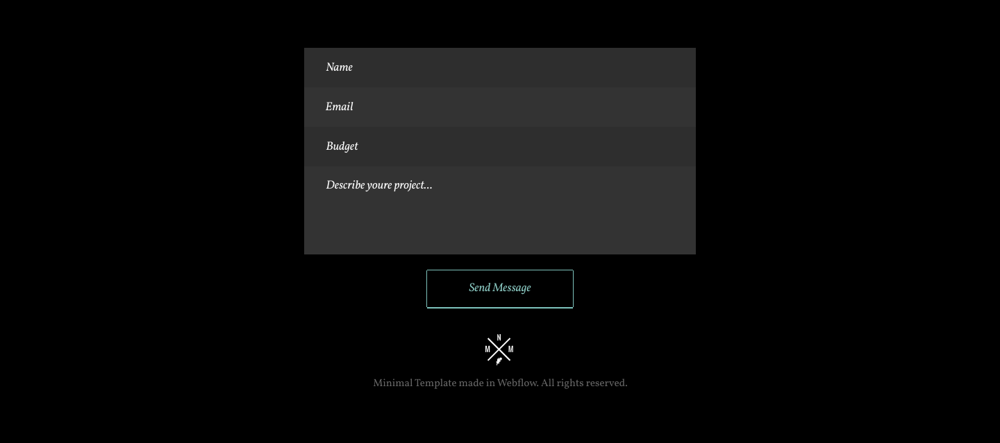
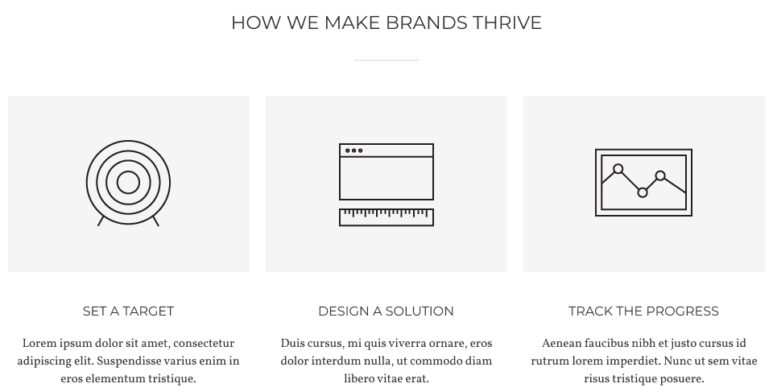
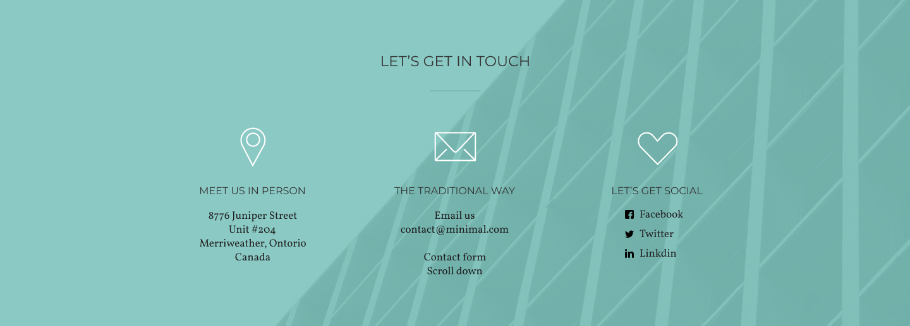

# lab_1

# human

## human__head

### human__eye human__eye --closed
### human__eye human__eye human__eye--open
### human__nose human__nose--breathing

## human__body
### human__lungs human__lungs--breathing
### human__kidneys human__kidneys--filtering
### human__heart human__heart--pumping

## human__legs
### human__muscles human__muscles--tense
### human__feet human__feet--walking
### human__bones human__bones--broken

# Header -> header.header>img.logo+nav.nav>ul.nav__list>(li.nav__item>a.nav__link)*4

# Форма -> form.form>(label.form__label>input.form__input.form__input--nam)+(label.form__label>input.form__input.form__input--email)+(label.form__label>input.form__input.form__input--budget)+(label.form__label>input.form__input.form__input--comments)+button.form__button+img.form__logo+p.form__text

# Карточка -> h2.heading+div.card>img.card__img+p.card__title+p.card__text

# Доп.блок -> section.info>h2.heading+ul.info__card>(li.info__card-item>img.card+h3.card__heading+p.card__info) + (li.info__card-item>img.card+h3.card__heading+p.card__contact+p.card__info) + (li.info__card-item>img.card+h3.card__heading+ul.card__links>(li.link>img.link__logo+p.link__text)*3)
